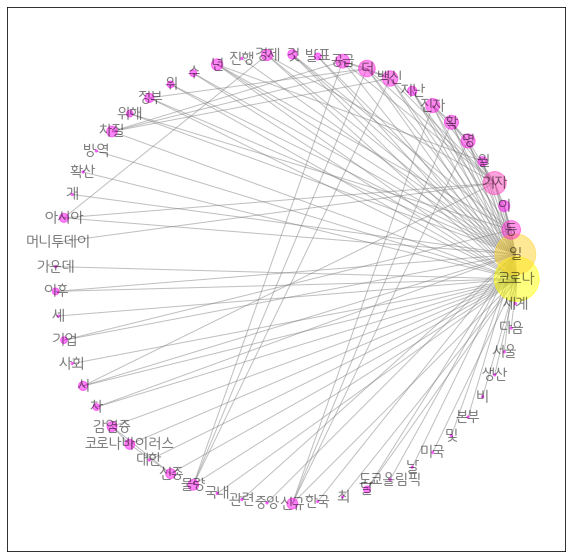

## 토픽에 대한 연관성 분석

*참고자료 : https://zephyrus1111.tistory.com/119 

장바구니 분석이라고도 불리는 연관분석. 연관분석에 사용되는 파라미터에는 지지도, 신뢰도, 향상도가 있다. 

- 지지도 :  P(A) 와 P(B)의 교집합
- 신뢰도 :  지지도 / P(A)
- 향상도 :  지지도 / P(A)*P(B)

[단계]

1. 빈발 품목 집합(Frequent Item Set) 생성
   - 각 품목 별로 발생 횟수가 특정 값 이상인 품목을 모아놓은 집합.
2. 연관 규칙 생성
   - 빈발 품목 집합에서 최소 신뢰도를 넘는 연관 규칙을 찾는다.

```python
import pandas as pd
import mixtend.preprocessing import TransactionEncoder
from mixtend.frequent_patterns import apriori
```

### 빈발 품목 집합 (Frequent Item Set) 생성

`mixtend `라이브러리를 통해 연관 분석을 진행할 수 있는데, 빈발품목집합은 각 행에 대해 품목을 리스트로 만들어 주고, 이를 다시 리스트로 묶어준다.

- dataset = 코로나 관련 기사들을 하나씩 리스트에 넣어 명사 단위로 정리해놓은 하나의 리스트

```python
print(dataset[:1])
```

> ```
> [['녀', '본격', '방학', '여름', '바캉스', '시즌', '시작', '코로나', '의', '차', '대유행', '사람', '집', '휴가', '야외', '이동', '중', '언제', '어디', '코로나', '가족', '감염', '알', '수', '장거리', '여행', '때문', '집', '요리', '게임', '수', '때', '가족']]
> ```


mixtend를 사용하기 위해선 DataFrame이 필요하다. `dataset` 으로부터 모든 값이 True/ False로 이뤄져 있는 데이터 프레임을 생성했다. 해당 품목이 해당 행에 포함되어 있다면 True, 없다면 False이다.

- transform()  : train data로부터 학습된 mean 값과 variance 값을 test data에 적용하기 위한 메서드
- fit()  : 모델이 해당 데이터를 학습하게 할 때 사용

```python
tran = TransactionEncoder()
tran_arr = tran.fit_transform(dataset)
tran_arr
```

> ```python
> array([[False, False, False, ..., False, False, False],
>        [False, False, False, ..., False, False, False],
>        [False, False, False, ..., False, False, False],
>        ...,
>        [False, False, False, ..., False, False, False],
>        [False, False, False, ..., False, False, False],
>        [False, False, False, ..., False, False, False]])
> ```

- tran.columns_  :  dataset에 나온 모든 단어를 중복 없이 리스트화해둔 것이다. 이데 만들 DataFrame의 column으로 적용할 것이다.

```python
tran_df = pd.DataFrame(tran_arr, columns = tran.columns_)
tran_df.head(3)
```

>  

### 연관 규칙 생성

```python
apr_item = apriori(tren_df, min_support = 0.1, use_clonames = True)
apr_item
```

>  

- association_rules  : 지지도가 0.5가 넘는 항목에 대해 향상도가 양의 상관관계에 있는 자료를 보여줌
- min_threshold  : 기본값은 0.8이다.

```python
form mixtend.frequent_patterns import association_rules

association_rules(apr_item, metric='lift', min_threshold=1.0)
```

> 

향상도가 1 이상인 경우, 유의미한 관계가 있다고 해석한다. 

 ### 연관 분석 시각화

연관분석 시각화는 **노드와 엣지**로 구성된 `networkx`를 사용한다.

```python
import networkz as nx

from matplotlib import font_manager, rc
font_name = font_manager.FontProperties(fname="C:/Windows/Fonts/MalangmalangR.ttf").get_name()
rc('font', family = font_name)
```

두 개의 노드를 엣지를 통해 이어야 되므로, itemsets에서 갯수가 2 이상인 것들만 뽑아낸다. 이 과정에 지지도의 조건도 함께 주어 데이터 프레임을 새로 만들었다.

```python
apr_item['length'] = apr_item['itemsets'].apply(lambda x : len(x))
apr_item.head()
```

>  

```python
apritem = apritem[(apritem['length'] == 2) & (apritem['support'] >= 0.07)].sort_values(by='support', ascending = False)
apritem.head(10)
```

>  

```python
# 그래픽 객체 생성
G1 = nx.Gragh()

# 노드 삽입
arp = (apritem['itemsets'])

# 엣지 추가
G1.add_edges_from(arp)
print(G1)
```

> ```python
> Graph with 12 nodes and 17 edges
> ```

- news_nx

  ```python
  news_nx = nx.pagerank(G1)
  ```

- nsize

  ```python
  # 최대 최소 정규화한 값에 2000을 곱함
  # 너무 작은 데이터의 크기를 키우기 위해 사용
  nsize = np.array([val for val in new_nx.values()])
  nsize = 2000 * (nsize - min(nsize))/(max(nsize) - min(nsize))
  ```

- pos

  ```python
  # 레이아웃의 종류
  pos = nx.circular_layout(G1)
  ```

```python
import matplotlib.pyplot as plt

plt.figure(figsize = (10, 10))
nx.draw_networkx(g, pos = pos, node_color = list( news_nx.values()), node_size = nsize,
                alpha = 0.5 , edge_color = '0.5', cmap = plt.cm.spring, font_size = 15,
                font_family = font_name)
plt.draw()
```

>  