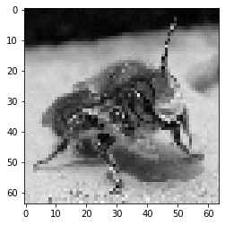

## 폴더에서 이미지 대량으로 가져오기

```python
import os
import cv2
import numpy as np
import matplotlib.pyplot as plt
```

배열 정보를 한번에 확인할 수 있는 함수를 미리 만들었다.

```python
def pprint(arr):
  print(f'type  : {type(arr)}')
  print(f'shape : {arr.shape}, ndim : {arr.ndim}, dtype : {arr.dtype}')
  print(f'data  : \n{arr}')
  print()
```


```python
# 이미지 폴더 정의
dirs = ['ants', 'bees']

# 이미지의 픽셀 저장(X), 레이블 저장(y) 리스트 생성
x = []
y = []

for idx, fname in enumerate(dirs):
    # 폴더 내 파일들을 리스트 형태로 저장
    files = os.listdir('./' + fname + '/')
    
    for f in files:
        # 이미지를 흑백으로 읽어옴
        img = cv2.imread(fnames+ '/' + f, 0)
        # 이미지 사이즈 변경
        img = cv2.resize(img,(64, 64))
        # 이미지를 np.array로 변경
        img = np.array(img).reshape(-1).tolist()
        
        # x에 픽셀정보 저장 (이미지 정보)
        x.append(img)
        # y에 레이블 정보 저장
        y.append(idx)
```

img = np.array(img).reshape(-1).tolist() 에서 `reshape(-1)` 을 통해 배열의 차원을 1차원으로 만들어준다. reshape 대신 `flatten()`을 사용해도 된다.

파일 내 모든 이미지 데이터들을 읽어와서 저장하기 위함이라 한 줄로 만들어버리고, 나중에 이미지를 다시 읽어낼 때 reshape(64,64)를 진행해서 일어주면 된다.


제일 마지막에 저장된 그림의 정보를 읽어와보자.

```python
x[-1]
```

> [18, 18, 16, 20, 17, ... , 190, 219, 187, 205, 207] 

위에서 img를 저장할 때 np.array로 감싸고 reshape를 진행하긴 했지만, tolist를 통해 마지막에 리스트로 저장했기 때문에 x[-1]은 하나의 리스트이다.


**2차원배열**로 만들어서 이미지를 읽어올 수 있다.

```python
x_dim2 = np.array(x[-1]).reshape(64, -1)
print(x_dim2)
print(x_dim2.shape)
```

>  ```python
>  [[ 18  18  16 ...  13  12  15]
>   [ 21  16  14 ...  18  13  14]
>   [ 19  15  17 ...   9  12  12]
>   ...
>   [208 195 222 ... 166 189 204]
>   [203 203 217 ... 210 215 202]
>   [224 200 215 ... 187 205 207]]
>  (64, 64)
>  ```

```python
plt.imshow(x_dim2, cmap = 'gray')
plt.show()
```

>  

### x와 y의 정보 확인

```python
x = np.array(x)
y = np.array(y)

pprint(x)
pprint(y)
```

> ```python
> type  : <class 'numpy.ndarray'>
> shape : (157, 4096), ndim : 2, dtype : int64
> data  : 
> [[126 137 100 ... 184 169 163]
>  [128 132 129 ... 122 110  88]
>  [190 190 190 ... 122 129 110]
>  ...
>  [118 116 128 ... 109 114 110]
>  [ 55  33  28 ...  80  88  81]
>  [ 18  18  16 ... 187 205 207]]
> 
> type  : <class 'numpy.ndarray'>
> shape : (157,), ndim : 1, dtype : int64
> data  : 
> [0 0 0 0 0 0 0 0 0 0 0 0 0 0 0 0 0 0 0 0 0 0 0 0 0 0 0 0 0 0 0 0 0 0 0 0 0
>  0 0 0 0 0 0 0 0 0 0 0 0 0 0 0 0 0 0 0 0 0 0 0 0 0 0 0 0 0 0 0 0 0 0 0 0 0
>  0 1 1 1 1 1 1 1 1 1 1 1 1 1 1 1 1 1 1 1 1 1 1 1 1 1 1 1 1 1 1 1 1 1 1 1 1
>  1 1 1 1 1 1 1 1 1 1 1 1 1 1 1 1 1 1 1 1 1 1 1 1 1 1 1 1 1 1 1 1 1 1 1 1 1
>  1 1 1 1 1 1 1 1 1]

### x와 y 합쳐서 저장(.npy)후 읽어들이기

```python
xy = np.concatenate((x, y.reshape(157,-1), axis = 1))
pprint(xy)
```

> ```python
> type  : <class 'numpy.ndarray'>
> shape : (157, 4097), ndim : 2, dtype : int64
> data  : 
> [[126 137 100 ... 169 163   0]
>  [128 132 129 ... 110  88   0]
>  [190 190 190 ... 129 110   0]
>  ...
>  [118 116 128 ... 114 110   1]
>  [ 55  33  28 ...  88  81   1]
>  [ 18  18  16 ... 205 207   1]]
> ```

각 행의 맨 끝을 보면 y데이터가 정상적으로 붙은 것을 확인할 수 있다.

이제 이 파일을 저장해보자. **하나의 배열을 하나의 파일에** 저장할거다.

#### 합친 xy를 저장

```python
np.save('ant_bee_img', xy)
```

이 코드를 실행하면 자동으로 파일이 다운로드된다. 확장자는 `.npy` 이다.

이 파일을 다른 곳에서 다시 읽어들여보자.

#### 저장한 파일 읽어들이기

```python
imgs = np.load('ant_bee_img.npy')
pprint(imgs[0])
```

> ```python
> type  : <class 'numpy.ndarray'>
> shape : (4097,), ndim : 1, dtype : int64
> data  : 
> [126 137 100 ... 169 163   0]
> ```

합쳤던 파일을 다시 분리해서 이미지를 읽어들일 수 있다.

```python
x =imgs[-1, :4096].reshape(64,-1)
y = imgs[-1, -1]

plt.imshow(x, cmap = 'gray')
```

>  


### 합치지 않고 각각 저장(.npz) 후 읽어들이기

- 저장

```python
np.savez('ant_bee_arr', x, y)
```

- 읽어들이기

```python
imgs = np.load('ant_bee_arr.npz')
imgs
```

> <numpy.lib.npyio.NpzFile at 0x7f8f5fbbdcd0>

npz파일은 x와 y 파일 각각이 저장된 형태라서 pprint나 print가 소용이 없다. 각각의 파일 명을 보여주는 함수 `.files`를 붙여서 인덱싱을할 수 있다.

```python
imgs.files
```

> ['arr_0', 'arr_1']

```python
pprint(imgs['arr_0'])
pprint(imgs['arr_1'])
```

> ```python
> type  : <class 'numpy.ndarray'>
> shape : (157, 4096), ndim : 2, dtype : int64
> data  : 
> [[126 137 100 ... 184 169 163]
>  [128 132 129 ... 122 110  88]
>  [190 190 190 ... 122 129 110]
>  ...
>  [118 116 128 ... 109 114 110]
>  [ 55  33  28 ...  80  88  81]
>  [ 18  18  16 ... 187 205 207]]
> 
> type  : <class 'numpy.ndarray'>
> shape : (157,), ndim : 1, dtype : int64
> data  : 
> [0 0 0 0 0 0 0 0 0 0 0 0 0 0 0 0 0 0 0 0 0 0 0 0 0 0 0 0 0 0 0 0 0 0 0 0 0
>  0 0 0 0 0 0 0 0 0 0 0 0 0 0 0 0 0 0 0 0 0 0 0 0 0 0 0 0 0 0 0 0 0 0 0 0 0
>  0 1 1 1 1 1 1 1 1 1 1 1 1 1 1 1 1 1 1 1 1 1 1 1 1 1 1 1 1 1 1 1 1 1 1 1 1
>  1 1 1 1 1 1 1 1 1 1 1 1 1 1 1 1 1 1 1 1 1 1 1 1 1 1 1 1 1 1 1 1 1 1 1 1 1
>  1 1 1 1 1 1 1 1 1]
> ```

이렇게 그대로 잘 읽어졌다! 

x의 [126 137 100 ... 184 169 163] 한 줄이 첫 번째 이미지의 정보다. 64 * 64니까 열의 수가 4096개가 되었고, 이미지로 읽어오기 위해 우리가 계속 x[0].reshape(64,64)를 진행했던 것이다.


그런데, x에서 인덱싱으로 이미지를 하나씩 가져와 reshape 하기가 귀찮아졌다. 한번에 하자!

```python
x2 = x.reshape(157, 64, 64)
x2[0]
```

> ```python
> array([[126, 137, 100, ..., 122,  54, 106],
>        [107, 143,  82, ..., 128,  40,  66],
>        [119, 149,  61, ...,  94,  33,  33],
>        ...,
>        [ 94, 114,  91, ...,  63, 154, 188],
>        [ 72,  37,  59, ..., 149, 181, 173],
>        [ 67,  80,  59, ..., 184, 169, 163]])
> ```

짠. x내의 모든 이미지가 64*64의 배열로 변경되었다!

```python
plt.imshow(x2[-1], cmap = 'gray')
plt.show()
```

>  

```python
pprint(x_2)
```

> ```python
> type  : <class 'numpy.ndarray'>
> shape : (157, 64, 64), ndim : 3, dtype : int64
> data  : 
> [[[126 137 100 ... 122  54 106]
>   [107 143  82 ... 128  40  66]
>   [119 149  61 ...  94  33  33]
>   ...
>   [ 94 114  91 ...  63 154 188]
>   [ 72  37  59 ... 149 181 173]
>   [ 67  80  59 ... 184 169 163]]
> 
>  ...
> 
> 
>  [[ 55  33  28 ...  80  20  32]
>   [ 51  31  30 ...  48  24  28]
>   [ 40  30  42 ...  31  24  28]
>   ...
>   [151  45  66 ...  71  75  73]
>   [ 41  51 196 ...  76  78  78]
>   [ 59  67 106 ...  80  88  81]]
> 
>  [[ 18  18  16 ...  13  12  15]
>   [ 21  16  14 ...  18  13  14]
>   [ 19  15  17 ...   9  12  12]
>   ...
>   [208 195 222 ... 166 189 204]
>   [203 203 217 ... 210 215 202]
>   [224 200 215 ... 187 205 207]]]
> ```

그냥 보여주고 싶어서 다 출력해봤다.! 

x2 는 3차원이고, 그 안에 하나의 이미지들은 2차원이다!