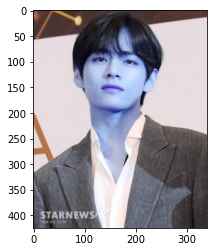
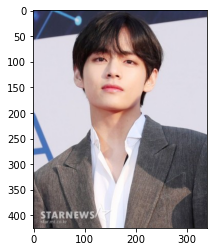
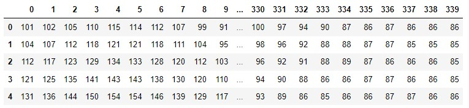
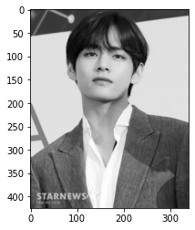
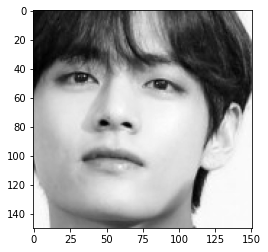
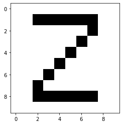
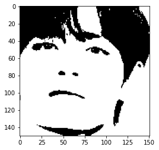

# 이미지 데이터의 이해

### 이미지 가져오기 

- 방법 1  : Opencv 모듈 이용

  ```python
  !pip install opencv-python
  ```

  ```python
  import cv2
  import marplotlib.pyplot as plt
  
  img = cv2.imread('./img1.jpg')
  plt.imshow(img)
  plt.show()
  ```

  >  

  ...~~미안해 태형아~~ 나도 이걸 처음 배워서 이렇게 불러와지는지 몰랐어...

  보다시피 우리가 아는 RGB 로 읽혀지는게 아니라 `BGR` 순서로 읽어들여져서 이렇게 된다고 한다.

  ```python
  img.shape
  ```

  > (425, 340, 3)

- 방법 2  : pillow 모듈 이용

  ```python
  !pip install pillow
  ```

  ```python
  from PIL import Image
  import matplotlib.pyplot as plt
  
  img2 = Image.open('./img1.jpg')
  plt.imshow(img2)
  plt.show()
  ```

  >  

  ~~휴 드디어~~ 제대로 읽어졌지만 앞으로 할 작업들은 위의 방법1을 쓴다.

  ```python
  img2.shape()
  ```

  > ```
  > AttributeError: shape
  > ```

  진행 시 방법 1은 제대로 작동한 반면, pillow로 읽어온 이미지는 오류가 생긴다.

  

#### 불러들인 이미지 컬러로 바꾸기

```python
img = cv2.cvtColor(img, cv2.COLOR_BGR2RGB)
plt.imshow(img)
```

>  

```python
print(img1.shape)
print(len(img1),'\t#세로사이즈(행)')
print(len(img1[0]),'\t#가로사이즈')
print(len(img1[0][0]), '\t#컬러 채널  : 세 가지 색상 조합')
```

> ```
> (425, 340, 3)
> 425 	#세로사이즈(행)
> 340 	#가로사이즈
> 3 		#컬러 채널  : 세 가지 색상 조합
> ```


## 이미지 데이터를 배열로 이해하기

```python
import pandas as pd

r,g,b = cv2.split(img)
b_df = pd.DataFra,e(b)
print(b_df.shape)
display(b_df.head())
```

> (425, 340)
>
> 

#### 이미지 데이터 그레이로 변경

```python
gray_img = cv2.cvtColor(img1, cv2.COLOR_RGB2GRAY)
plt.imshow(gray_img, cmap = 'gray')
```

>  

~~할머니의 첫사랑이네..~~ 

그레이로 변경된 이미지의 구조(shape)를 살펴보자.

```python
print(gray_img.shape)  # 그레이는 2차원
print(gray_img)
```

> ```
> (425, 340)
> [[66 67 69 ... 65 65 65]
>  [69 71 74 ... 64 64 64]
>  [75 78 84 ... 64 64 63]
>  ...
>  [57 62 65 ... 50 47 44]
>  [53 55 60 ... 52 49 45]
>  [51 52 55 ... 47 48 46]]
> ```

### 이미지 슬라이싱으로 해상도 변경

gray_img를 DF로 변경해준 뒤, numpy를 통해 배열 형태로 변경해준다.

```python
import numpy as np

gray_df = pd.DataFrame(gray_img)
gray_arr = np.array(gray_df.iloc[50:200, 100:251])  # [세로축(행 개수), 가로축(열 개수)]
gray_arr
```

> ```
> array([[ 30,  25,  19, ..., 224, 224, 224],
>        [ 26,  18,  14, ..., 224, 224, 224],
>        [ 20,  13,  11, ..., 224, 224, 224],
>        ...,
>        [225, 225, 225, ..., 225, 225, 225],
>        [225, 225, 225, ..., 226, 226, 226],
>        [225, 225, 225, ..., 226, 226, 226]], dtype=uint8)
> ```

gray_arr을 통해 다시 이미지를 로드할 수 있다.

```python
plt.imshow(gray_arr, cmap = 'gray')
plt.show()
```

>  

왜 이렇게 잡힌거지? 싶다면 내가 고의로 한게 맞다. gray_arr은 태형이의 얼굴의 정보였다..

## 이미지 데이터를 생성해보자

```python
u_img = np.array([[255,255,255,255,255,255,255,255,255,255],
         [255,255,0,0,0,0,0,0,255,255],
         [255,255,255,255,255,255,255,0,255,255],
         [255,255,255,255,255,255,0,255,255,255],
         [255,255,255,255,255,0,255,255,255,255],
         [255,255,255,255,0,255,255,255,255,255],
         [255,255,255,0,255,255,255,255,255,255],
         [255,255,0,255,255,255,255,255,255,255],
         [255,255,0,0,0,0,0,0,255,255],
         [255,255,255,255,255,255,255,255,255,255]])
plt.imshow(u_img, cmap = 'gray')
plt.show()
u_img.shape
```

>    

0은 검정, 255는 흰색을 나타낸다. Z를 만들어보았다. 위의 작업을 한번 하고나니 2차원 이미지는 이해가 간다.


## 픽셀 이진화

지금까지의 태형이의 사진은 명암이 존재했는데, 이제 그런것도 다 없애고 이진화를 진행할 것이다.

cv2.threshold(src, thresh, maxval, type)
    - src  : 이미지나 배열
        - thresh  : 임계점
        
    - maxval  : 임계점을 지났을 때 적용할 값
            
        - type : 적용할 타입
            
            * cv2.THRESH_BINARY
            
            - cv2.THRESH_BINARY_INV  : THRESH_BINARY와 반전결과
            - cv2.THRESH_TRUNC  : 명암이 살아있는 상태
            - cv2.THRESH_TOZERO
            - cv2.THRESH_TOZERO_INV

```python
ret, bin_img = cv2.threshold(gray_arr, 100, 255, cv2.THRESH_BINARY)
plt.imshow(bin_img, cmap = 'gray')  # 명암이 사라짐 only 흰,검만 나옴.
plt.show()
```

>  

위의 다섯 가지 타입을 난 전부 다 돌려보았지만, 양심상 더 괴롭히면 안티라고 생각할까봐.. 각자 맘에 드는 사진으로 돌려보길 추천한다! ~~좋아하는 사진으로 돌리면 재밌음.~~