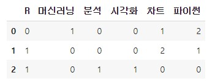

## DTM 알고리즘의 이해

### 단어 필드 제작 - 문장 토큰화

```python
txt=['파이썬 차트 파이썬 머신러닝',
      '차트 파이썬 R 차트',
       'R 분석 시각화']
```

1.  단어를 빈칸 단위로 나누기 (단어 필드 제작)

   ```python
   tmp = [x.split() for x in txt]
   tmp
   ```

   > ```python
   > [['파이썬', '차트', '파이썬', '머신러닝'], ['차트', '파이썬', 'R', '차트'], ['R', '분석', '시각화']]
   > ```

2.  tmp를 1차원 자료로 변경하기 (단어 필드 제작)

   ```python
   ### 방법 1   : 컴프리헨션
   tmplst = [j for i in tmp for j in i]
   tmplst
   ```

   > ['파이썬', '차트', '파이썬', '머신러닝', '차트', '파이썬', 'R', '차트', 'R', '분석', '시각화']

   ```python
   ### 방법 2   : numpy.concatenate(tmp)를 이용한 1차원 배열 생성 가능
   import numpy as np
   
   np_arr = np.concatenate(tmp)
   np_arr
   ```

   > ```python
   > array(['파이썬', '차트', '파이썬', '머신러닝', '차트', '파이썬', 'R', '차트', 'R', 
   >        '분석','시각화'], dtype='<U4')
   > ```

3.  단어를 고유값만 출력 (단어필드제작)

   ```python
   ### 방법 1   : np.unique(np_arr)
   uniqueList=np.unique(np_arr)
   uniqueList
   ```

   > ```python
   > array(['R', '머신러닝', '분석', '시각화', '차트', '파이썬'], dtype='<U4')
   > ```

4.  단어 필드 작성 (단어 필드 제작)

   단어필드를 작성하기 위해서는 중복이 없는 `필드명`과 , `카운트 대상`인 리스트 두 가지가 필요하다.

   - 필드명  : uniqueList
   - 카운트 대상  : tmp

5.  DTM - 단어별 카운트 

```py
result = []
N=len(txt)
for i in range(N): # 각 문서에 대해서 아래 명령을 수행
    result.append([])
    d = txt[i]
    for j in range(len(vocab)):
        t = vocab[j]        
        result[-1].append(d.count(t))

tf_ = pd.DataFrame(result, columns = vocab)
tf_
```

>  

