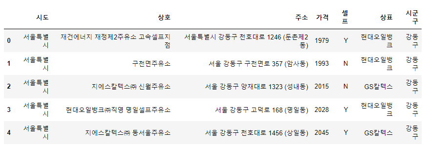
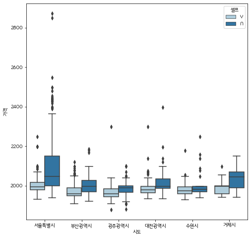
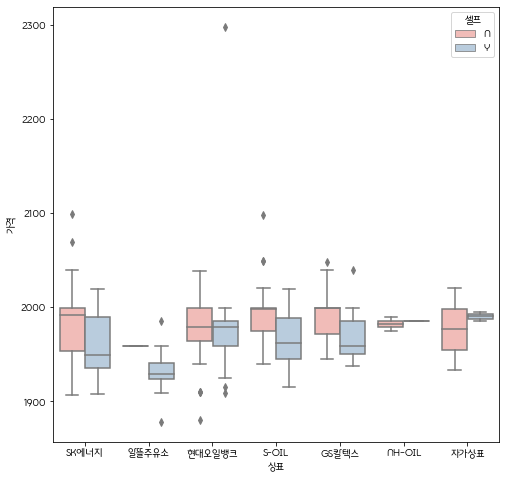
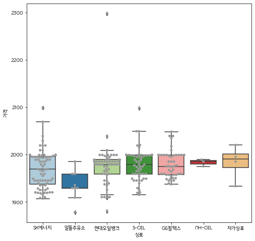

## 유가정보 분석 시각화

```python
import matplotlib.pyplot as plt
import seaborn as sns

# 라인 깨짐 방지
%matplotlib inline

import platform
from matplotlib import font_manager, rc

font_name = font_manager.FontProperties(fname="C:/Windows/Fonts/MalangmalangR.ttf").get_name()
rc('font', family = font_name)
```

 시각화에 사용할 `df_oil` 데이터는 아래와 같이 생겼다.



### Seaborn을 사용한 박스플롯

- hue   :  나누는 세부기준 설정 
- palette   : 플롯 색상 지정

```python
sns.boxplot(data = df_oil, x='시도', y = '가격', hue = '셀프', palette = 'Paired')
plt.show()
```



위 결과를 보니 광주 광역시의 oil 가격이 대체적으로 가장 낮아 보이므로, 광주에서 더 자세하게 시각화를 진행해보도록 하자.

#### 광주광역시 내의 상표(주유소브랜드)에 따른 가격

```python
tmpdf = df_oil[df_oil['시도'] == '광주광역시']

plt.figure(figsize = (8, 8))
sns.boxplot(data = tmpdf, x = '상표', y = '가격', hue = '셀프', palette= 'Pastel1')
plt.show()
```



#### 시 군구별 상표에 따른 가격 + 분포

- sns.`swarmplot`   :  데이터를 박스 플롯 위에 보여주어 분포를 더 잘 파악할 수 있다.

```python
plt.figure(figsize = (8, 8))
sns.boxplot(data = tmpdf, x = '상표', y = '가격', palette= 'Paired')

sns.swarmplot(data = tmpdf, x = '상표', y = '가격', color='.6')
plt.show()
```

