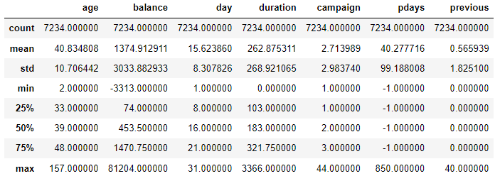
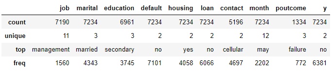

## 전처리

### 결손값 확인

결측치 개수 확인

```python
df.isna().sum
```

> ```
> age             0
> job            44
> marital         0
> education     273
> default         0
> balance         0
> ...
> ```

결손값이 포함된 열

```python
df.isnull()
```

> ```
>         age    job  marital  education  default  balance  housing   loan  \
> 0     False  False    False      False    False    False    False  False   
> 1     False  False    False      False    False    False    False  False   
> 2     False  False    False      False    False    False    False  False 
> ```

결손값이 포함될 행

```python
df.isnull().any(axis = 1)
```

> ```
> 0        True
> 1        True
>      ...  
> 7231    False
> 7232     True
>    7233     True
> Length: 7234, dtype: bool
> ```

행별 결손값의 숫자가 많은 순서로 정렬

```python
df.isnull().sum().sort_values(ascending = False)
```

> ```
> 139     4
> 1762    4
>     ..
> 6037    0
> 4047    0
>    Length: 7234, dtype: int64
> ```

### na값 제거

- dropna(how = 'any')  : 행에 na가 하나라도 있으면 삭제
- dropna(how = 'all')  : 행 전체가 na면 삭제
- df.dropna(`subset` = ['job','education'])  : `subset`을 통해 특정 필드만 제거 
- df.dropna(`thresh` = 2400,  `axis`  = 1)  : 결측치가 2400개 이상인 '열' 제거

### 결측치 대체

결측치를 대체할 때는, 먼저 dtyeps를 확인해 어떤 값으로 대체할지를 확인해줌.

- df.`fillna`('unknown')  : 결측치를 전부 unknown으로 채워줌.
- df.fillna(`{'colname' : 'unknown'}`)  : 집합 방식으로 표현해 해당 열의 결측치를 unknown로 채워줌.

### 특이값 처리

1.  표준점수 이용방법

   > 평균 = 0, 표준편자 = 1 인 정규분포로 변환 후 +3s -3s을 넘는 이상치 제거

2. IQR 방식

   > IQR = Q3(3사분위) - Q1(1사분위) . +1.5IQR과 -1.5IQR을 넘어가는 이상치 제거

   ```python
   Q1 = df.age.describe()['25%']
   Q3 = df.age.describe()['75%']
   # Q2 = df.age.describe()['50%']  : 중앙값. (!= 평균)
   
   IQR = Q3 - Q1
   max_num = Q3 + 1.5 * IQR
   min_num = Q1 - 1.5 * IQR
   
   print('min :',min_num)
   print('max :',max_num)
   ```

   > ```
   > min : 8.0
   > max : 72.0
   > ```

 3. 나이 age가 18세 미만, 100세 이상인 데이터 삭제 

    조건문으로 & 나 | 를 쓰게 될 때는, 괄호를 묶어주어야 정상 출력이 된다.

    ```python
    df[(df.age >= 18) & (df.age < 100)] 
    ```


## EDA

- 데이터형이 수치형인 각종 통계량의 계산

```python
df.describe()
```



- 데이터형이 문자열인 각종 통계량 계산

```python
df.describe(include = [object])
```



- age와 balance의 상관관계

```python
df[['age','balance']].corr()
```

