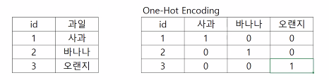
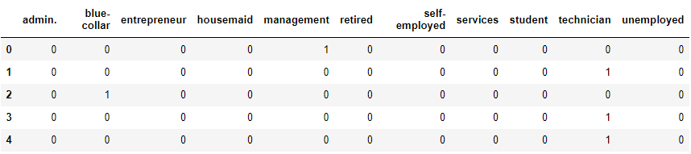

### 문자열 수치화하기

#### 문자열을 수치형으로 변환

```py
df['열이름'] = df['열이름'].replace({'yes':1, 'no':0})
```

#### One - Hot 인코딩



```python
# job을 더미 변수로 변경
df_job = pd.get_dummies(df.job)

# 선두에서 5행까지 표시
df_job.head()
```



job 에 있던 모든 직업들이 One-Hot Encoding을 통해 변환된 것을 볼 수 있다. 다른 문자 자료들도 전부 현환하여 concat을 통해 옆으로 이어붙이면 *열의 개수가 어마어마하게 늘어난다.*

```python
df_tmp1 = pd.concat([df_tmp, df_job, df_martial, df_education, df_contact, df_month], axis = 1)

# 선두에서 5행까지 표시
print(df_tmp.shape)
print(df_tmp1.shape)
```

> (6870, 11)
>
> (6870, 43)

shape를 통해 확인해본 결과, 열의 수가 11개에서 43개까지 늘어났다.

이런 문제를 방지하고자 Sklaern이 있다. 아주 조금 맛보기만 진행하였다.


### Sklearn 사용하여 문자를 수치화하기

먼저 `!pip install sklearn`을 통한 모듈 설치가 필요하다.

사이킷런을 실행할 데이터 프레임을 복사해서 진행하겠다.

- LabelEncoder()  : 사이킷런에서 제공하는 문자를 숫자로 변환하는 함수

```python
from sklearn.preprocessing import LabelEncoder

df_sk = df.copy()

le = LabelEncoder()
le.fit(df_sk.job)

df_sk.job = le.transform(df_sk.job)
```

```python
df_sk['job'].unique()  # 사이킷 런으로 변환한 결과의 고유값
```

> array([ 4,  9,  1,  5,  7,  0,  2,  6, 10,  8,  3])

```python
df.job.unique()  # 사이킷 런으로 변환하기 전의 고유값
```

> array(['management', 'technician', 'blue-collar', 'retired', 'services', 
>
> ​            'admin.', 'entrepreneur', 'self-employed', 'unemployed', 
>
> ​            'student', 'housemaid'],  dtype=object)

